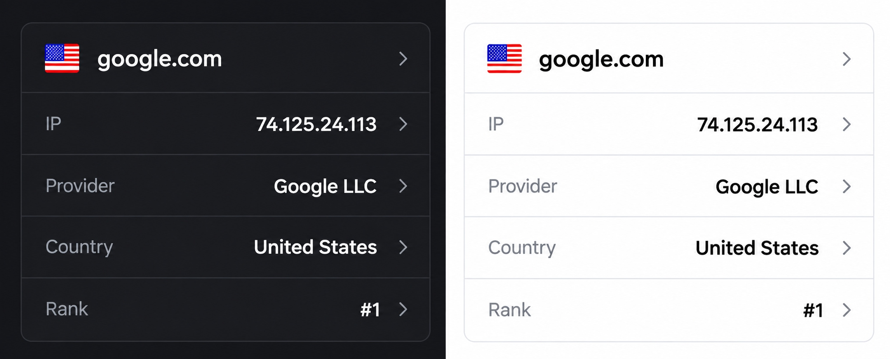

# Country Flag

A lightweight Chrome extension (Manifest V3) that shows what the tab you are on
is actually serving:



The header, the IP, Provider and Country rows open the matching public detail
page in a new tab. The Rank row is intentionally not a link: Tranco only exposes
a raw API endpoint, there is no page a user would want to land on.

## Getting started

```bash
npm install     # also runs `wxt prepare`
npm run dev     # launches Chrome with the extension loaded
npm run build   # production build in .output/chrome-mv3
npm run zip     # distributable archive in .output
npm run compile # TypeScript check (tsc --noEmit)
npm run icons   # regenerate public/icon/*.png
```

## Architecture

```
src/
├── assets/
│   └── theme.css              # shared palette + data-theme switching
├── entrypoints/
│   ├── background.ts          # wires the icon sync + cache reset on update
│   ├── options/
│   │   ├── index.html         # theme + cache controls (open_in_tab)
│   │   ├── main.ts
│   │   └── style.css
│   └── popup/
│       ├── index.html
│       ├── main.ts            # active tab → domain → one lookup → rows
│       ├── components.ts      # InfoHeader / InfoList / InfoListItem
│       └── style.css          # inset grouped list
├── lib/
│   ├── icon-sync.ts           # per-tab toolbar icon: events, races, re-apply
│   ├── action-icon.ts         # renders the flag into the toolbar icon
│   ├── lookup.ts              # the one API client (validate + cache + outcomes)
│   ├── tranco.ts              # direct Tranco fallback (registrable domain)
│   ├── cache.ts               # generic chrome.storage.local cache with TTLs
│   ├── settings.ts            # stored preferences (theme)
│   ├── site.ts                # tab URL → domain
│   ├── domain.ts              # hostname normalization, private ranges, registrable domain
│   ├── country-codes.ts       # ISO alpha-2 validation + flag emoji fallback
│   └── links.ts               # every external URL + "open in a new tab"
└── types/
    └── api.ts                 # shapes of the untrusted API responses
```

Networking lives in `lib/`, never in the UI. The popup does not message the
service worker: it has host permissions itself, so every request goes out
directly. `background.ts` only wires lifecycle work.

The popup element *is* the card (`<main id="app" class="app card">`), so the
header and the row list sit directly inside it: a flat, full-bleed surface with
no nested wrapper, no outer padding and no border or rounded corners.

## Data source

Everything comes from **one** endpoint — [geoip.kristal.id](https://geoip.kristal.id),
which aggregates DNS, GEO-IP and Tranco behind a single response:

```
GET https://geoip.kristal.id/v1/lookup/<domain>
```

```json
{
  "domain": "google.com",
  "ip": "142.250.4.100",
  "country": { "code": "US", "name": "United States", "flag": "data:image/png;base64,…" },
  "asn": { "number": 15169, "name": "Google LLC" },
  "rank": 1
}
```

| Row | Comes from |
| --- | --- |
| IP | `ip` (+ link to `check-host.cc/?host=<ip>`) |
| Provider | `asn.name` (+ link to `bgp.tools/as/<asn.number>`) — `Unknown` when `asn` is `null` |
| Country | `country.name` (+ Google Maps link) |
| Rank | `rank` — `Not ranked` when it is `null` **after** the direct Tranco fallback below |
| Flag (header + toolbar icon) | `country.flag` data URI; the emoji is the fallback when it is `null` |

The payload is untrusted input: every field is validated in `lib/lookup.ts`, and
a malformed answer is treated as a failure instead of being rendered.

### Error states

| API answer | Popup |
| --- | --- |
| `200` | rows as above |
| `404 DOMAIN_NOT_FOUND` (does not resolve) | IP / Provider / Country / Rank `Unavailable`, globe icon |
| `400 INVALID_DOMAIN` | same, not cached |
| `429 RATE_LIMITED` | same, not cached (the API allows 120 requests/minute) |
| `5xx`, timeout, network, bad payload | same, not cached |

### Two behaviours worth knowing

* **`rank: null` triggers a direct Tranco check.** The API resolves Tranco in
  parallel but tolerates a Tranco failure by answering `rank: null`, which looks
  exactly like "not ranked". So when an answer arrives without a rank, the
  extension asks `tranco-list.eu/api/ranks/domain/<registrable-domain>` once
  (`dash.cloudflare.com` → `cloudflare.com`, because Tranco indexes registrable
  domains): a rank found
  there **updates the cached answer** (so a ranked domain stops reporting
  `Not ranked`), and a `null` from Tranco means the domain really has no rank.
  The fallback only runs on a cache miss, so it costs at most one extra request
  per domain per 10 minutes. A *failed* Tranco call is not treated as "not
  ranked": it is remembered as "rank unknown" and only cached for 60 seconds, so
  it corrects itself quickly instead of pinning `Not ranked` for minutes.
* **A missing flag is normal.** `country.flag` is `null` when the proxy could not
  fetch it; the popup and the toolbar icon fall back to the Unicode emoji.

### External rows

* Header (domain) → `https://check-host.cc/?host=<domain>`
* IP → `https://check-host.cc/?host=<ip>`
* Provider → `https://bgp.tools/as/<asn>`
* Country → `https://www.google.com/maps/place/<Country+Name>/`
* Rank → not clickable

## Toolbar icon

The extension starts with a globe icon. Opening a page (or switching to its tab)
makes the service worker detect the country and replace the icon of *that tab*
with that country's flag — no need to open the popup. The icon is re-applied on
every load event, because a refresh reports no URL change and Chrome drops
per-tab icons when a page navigates. The country comes from the lookup response
(the popup shares the same cached answer, so a page is never looked up twice),
and the flag image in it is rendered once per country. Tabs whose country cannot
be determined (does not resolve, API failure, `chrome://`, `file://`, ...) keep
the globe, never a wrong flag. When the response has no flag image the icon falls
back to the Unicode emoji, i.e. the two-letter country code on Windows.

## Options page

Open it from `chrome://extensions` → **Details** → **Extension options**, or by
right-clicking the toolbar icon → **Options**. It opens in its own tab
(`options_ui.open_in_tab`).

| Setting | What it does |
| --- | --- |
| **Appearance**: System / Light / Dark | Stored as `settings:theme` in `chrome.storage.local` and applied to both the popup and the options page. `System` follows `prefers-color-scheme`; Light and Dark override it (useful when the OS theme and the popup should differ). |
| **Cache**: count + **Clear cache** | Shows how many lookups are cached and clears them all in one click (the cached responses of the lookup API). |

Settings are not cache: clearing the cache never touches them, and the theme is
applied before the popup renders its DOM, so nothing flashes.

## Behaviour

* **One request per domain.** The popup and the toolbar icon share the same
  cached answer, so a page is never looked up twice.
* **Loading**: the popup renders instantly and the row values are replaced as
  soon as the answer arrives.
* **Failure isolation**: a `404`/`400`/`429`/`5xx`, a timeout or a malformed
  payload all leave the four rows at `Unavailable` and the toolbar icon at the
  globe — never a half-drawn or wrong value. Only the popup needs to explain it;
  the icon simply stays honest. Because the API merges DNS + GEO-IP + Tranco, a
  broken upstream provider surfaces as an `Unavailable` row rather than a
  silently wrong one.
* **Unsupported pages**: `chrome://`, `chrome-extension://`, `edge://`,
  `about:`, `file://` and `view-source:` show "No website information". Pages on
  the machine itself (`localhost`, `*.local`, `*.internal`, `10/8`, `172.16/12`,
  `192.168/16`, `127/8`, link-local, CGNAT) show "Private connection - Localhost
  or Private IP address" and are never sent to any API.
* **Caching** (`chrome.storage.local`, `{ value, cachedAt }`): a settled answer
  10 minutes (including "does not resolve"), an answer whose rank is still
  unknown 60 seconds, and transient failures are not cached at all - so the next
  open retries. `background.ts` clears the cache after an extension update.

## Hostnames

`https://www.google.com/search?q=test` becomes `google.com`: the hostname is
lowercased, the trailing root dot and the port are removed, and a leading
`www.` is dropped because it is never meaningful. Other subdomains are preserved
(`blog.example.com` stays `blog.example.com`).

DNS, the lookup API and the detail links always use the hostname as the tab
reported it (minus a leading `www.`), because that is what the browser is
actually talking to. The only place a *registrable* domain is derived is the
Tranco fallback, which needs it: Tranco indexes `cloudflare.com`, never
`dash.cloudflare.com`. That reduction is a small ccTLD-aware heuristic
(`example.co.uk` keeps three labels, `dash.cloudflare.com` becomes
`cloudflare.com`, an IP literal is left alone) rather than a full Public Suffix
List — the real list is ~200 KB, and a wrong guess there only costs one wasted
request.

## Permissions

| Permission | Why |
| --- | --- |
| `storage` | Cache the API answers and the user settings. |
| `tabs` | Read tab URLs and keep the per-tab toolbar icon in sync. |
| `https://geoip.kristal.id/*` | The single API this extension talks to. |
| `https://tranco-list.eu/*` | The direct Tranco fallback used when that API reports no rank. |

No `<all_urls>`, no content scripts, no injected code. Remote responses are
treated as untrusted: values are validated, rendered with `textContent` and
every external URL is built by a validating helper.

## Tech

WXT + TypeScript + vanilla HTML/CSS, Manifest V3, no runtime dependencies.
